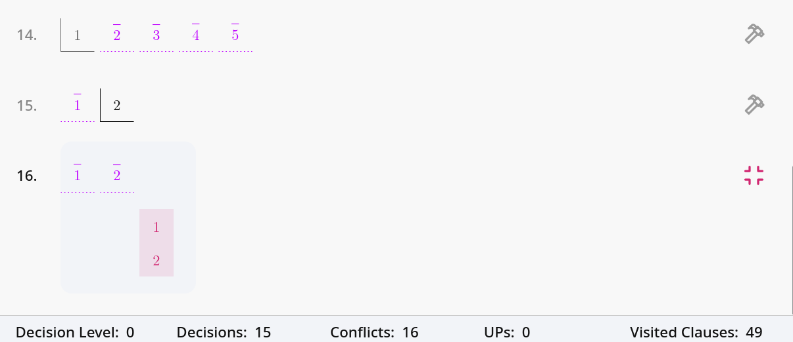
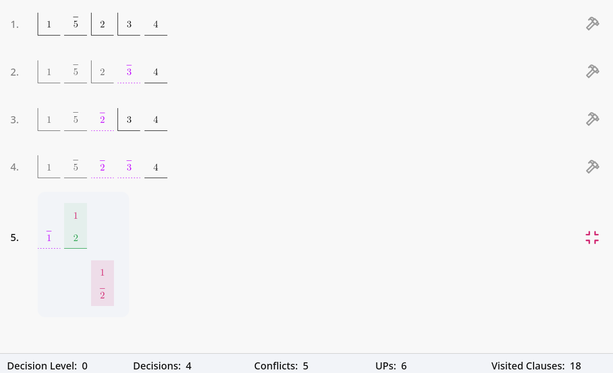
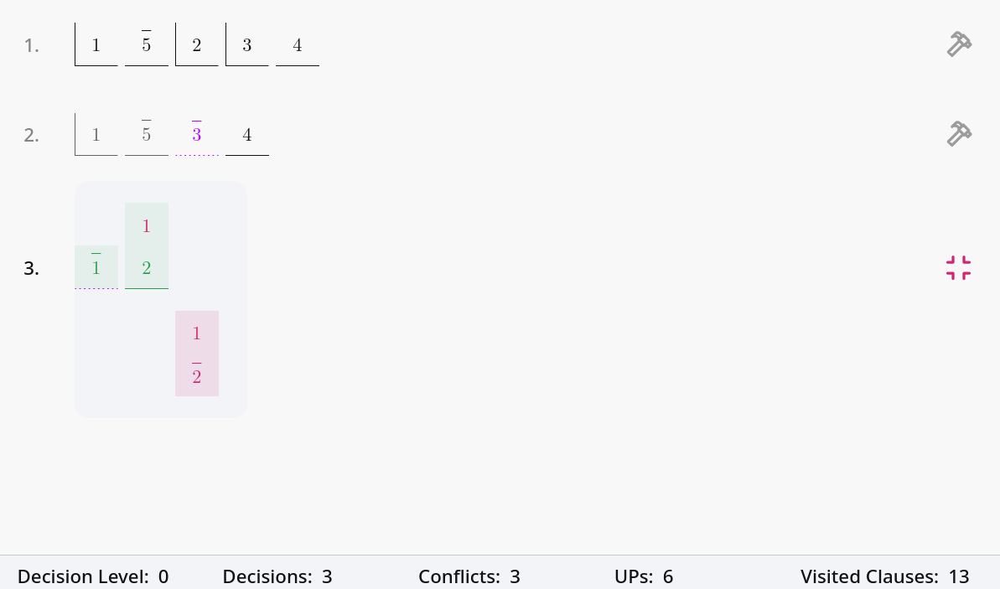
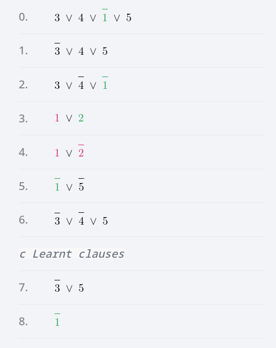
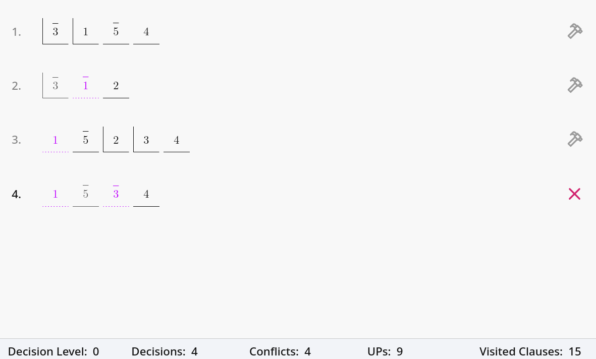

# Demo

Given the instance $F$:

$$F = (3 \lor 4 \lor \overline{1} \lor 5) \land (\overline{3} \lor 4 \lor 5) \land (3 \lor \overline{4} \lor 1) \land (1 \lor 2) \land (1 \lor \overline{2}) \land (\overline{1} \lor \overline{5}) \land (\overline{3} \lor \overline{4} \lor 5)$$

The formula $F$ contains five variables and seven clauses. Using simple backtracking, it takes sixteen conflicts to be aware that the formula is unsatisfiable (see Figure (a)).

We proceed with the explanation of **DPLL algorithm** and its visual representation in **SAT-IT** employing a comparison with backtracking. In here, we intend to present in detail the occurrence lists, as it is the visual method that captures the detection of unit clauses and clauses that became violated by the current assignment.

DPLL required five conflicts to demonstrate the unsatisfiability of the formula $F$, the reason for this reduction is **UP**, which entails many of the literals as visiting the occurrence of the complementary of the latest assignments (see Figure (b)).

---

### Figure 1: Comparison of search processes over the formula $F$

**Figure (a) - Backtracking**

**Figure (b) - DPLL**

> **Caption:** Figures (a) and (b) represent the search space of the Backtracking and DPLL algorithms.

---

Next, we detail how **learning from conflicts** leads to a more efficient way of finding a solution or demonstrating unsatisfiability. The execution of **CDCL** over the formula $F$ is shown in Figure (c). In this example, the assignments for trails one and two lead to two conflictive clauses. Due to these conflictive clauses, in order, conflict analysis was initiated, which resulted in the derivation of clauses $(\overline{3} \lor 5)$ and $(\overline{1})$ through resolution. These two clauses are learnt, resulting in the update of the formula, i.e.:

$$F' = F \land (\overline{3} \lor 5) \land (\overline{1})$$

From the last trail, we reached a dead end, where no decision can be undone, stating that $F$ is unsatisfiable. Also, in trail two of Figure (c), after the conflict analysis in trail one, not one but two decision levels were undone by **backjumping**.

---

### Figure 2: CDCL Search and CNF Update

**Figure (c) - CDCL search space.**

**Figure (d) - CNF instance.**

**Figure (e) - What if scenario.**

> **Caption:** Comparison of search processes over the formula $F$. Figure (e) represent the search space under different initial decisions $\overline{3}$, while Figure (d) displays the updated CNF due to the visited search space presented in Figure (e).

---

Following the CDCL overview, we will show that most of the execution time is spent traversing occurrence lists to visit clauses that can potentially trigger a UP or be falsified. Hence, it is of the upmost importance to optimize this process. To address this, we will present the **2WL scheme** for minimizing the number of visited clauses. By watching two literals in every clause, it is possible to ensure that a clause has not become unit or falsified.

*   For the formula $F$, enabling the 2WL scheme in CDCL avoids visiting **five less clauses** than basic CDCL.
*   For such a small instance, this is already a notable boost in performance.
*   The effect of enabling 2WL is appreciated by the statistics that appear in the bottom part of the application.

Furthermore, we will also demonstrate that even with the enhancements of 2WL in CDCL, certain structures like the **Pigeonhole Principle** became difficult to solve. The hardness of solving such problems is inherent in the proof system under which SAT-solvers are based (resolution). Such problems are difficult because counting for SAT is one of its limitations.

We consider that ***what-if*** scenarios are one of the strengths of SAT-IT. A *what-if* scenario allows the application users to interact with the solving procedure by enabling manual assignments instead of the default assignment that would be done by the implemented heuristic. The assignment of one literal instead of another can lead to a totally different search space. For example, by using plain CDCL and the formula $F$, if the first literal decided is $\overline{3}$---instead of the literal $1$ given by the automatic assignment heuristic---as shown in Figure (e), a different search space would have been traversed to show the unsatisfiability of the formula.

Alongside the functionalities and the flow management of SAT-IT already presented, the tool presents other utilities that may be worth mentioning in the presentation, such as:
*   Literal level breakpoints
*   Statistics preview

As SAT-IT is in continuous development, other interesting features will appear in next releases.
